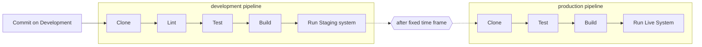

# Project Proposal

## Idea

For this project we want build a CI/CD system for a simple application in a two stage environment with the use of Tekton.

### Description

For our CI/CD system we will implement two Tekton Pipelines: one for the staging environment and one for the production. We will make use of Tekton Triggers to execute these pipelines automatically. The whole deployment process from commit to production will look as follows:

We will trigger the development pipeline automatically every time a commit to the development branch is made. After a successful development pipeline, the application runs on an online staging environment. After a fixed amount of time of the staging environment being online and working (e.g. one month, 10 successful commits on dev), the production pipeline is triggered automatically to create a patch update on the live system.

### Kubernetes CRD(Custom Resource Definition)
The Kubernetes API consists of a set of resources that store a collection of API objects of a certain kind (e.g., the built-in pods resource contains a collection of Pod objects; deployment resource, replicaset resource, etc.). The command `kubectl api-resources` lists all the resource types available in a cluster. We will use it by combining it with the `kubectl get` command to list every instance of every resource type in a Kubernetes namespace.
A custom resource is an extension of the Kubernetes API that is not necessarily available in a default Kubernetes installation. A custom resource definition is a defined custom resource. Tekton is based on Kubernetes CRDs.

In our project we plan to use `PipelineResource`, `Task`, `TaskRun`, `Pipeline`, `PipelineRun`, `EventListener`, `Trigger`, `TriggerBinding`

## Milestones

### Milestone 1 (Understanding Tekton & Setup - 25.12.2022)
- First draft and setup. Install Tekton on our clusters. Develop a simple application that will be used for the pipeline.

### Milestone 2 (Implementing our Project - 15.01.2023)
- Implement application *Steps*/*Tasks* (YAML) - as explained above and create *TaskRuns*
- Use tasks from the *Tekton Catalog* (clone, lint, test, build,..)
- Define a *Pipeline* (YAML) as a collection of tasks. 
- Create *PipelineRun*s.
- After the manual execution from above, automate this process by defining a Tekton *Trigger*, which creates a run automatically on demand (e.g., after a developers does a git push). 

### Milestone 3 (Submission - 18.01.2023)
- Test our implementation.
- Create a demonstration.
- Write a documentation.
- Prepare a presentation for the final lecture.

## Responsibilities

This technology is new for us and we aim to learn all parts of it, we try to work together and include everyone in the process of implementing Milestone 2. Because our scope will also be completely clear after Milestone 1, we can decide to further split responsibilities there. Once the main project is implemented (Milestone 2 is finished) we will divide the work for the final submission as follows:

**Eva Mayer (k11826767)**
- Demo

**Tim Seferagic (k11814937)**
- Documentation

**Daniel Raso (k11904965)**
- Presentation
