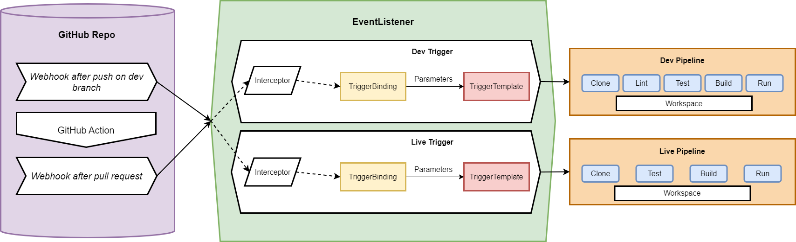

# Cloud Computing Project

This is the repo of the project for the course Special Topics Cloud Computing at the JKU Linz.

The original proposal for this project can be found in [PROPOSAL.md](PROPOSAL.md).

## Learnings and project structure

### Tekton Basics
Tekton is a powerful yet flexible Kubernetes-native open source framework for creating continuous integration and delivery (CI/CD) systems. The goal is to make CI/CD easier for everyone. It does this by giving you maximum flexibility, meaning, it abstracts the underlying implementation details and specific concepts of Kubernetes. The users can focus on creating powerful pipelines and choose the build, test and deploy workflows based on their team's requirements. All the building blocks are basically Kubernetes CRDs (Custom Resource Definition). 

#### Building blocks
`Step`: the smallest unit in Tekton. Each step is equivalent to a container. Can have specified inputs and outputs.  
`Task`: sequence of steps running a sequence of containers. It executes a pod on the K8s cluster. All steps inside a task have access to a shared workspace which is mounted to the pod as an implicit volume. Tekton tasks are a K8s CRD of kind Task, therefore they have a specified name so that they can be referenced (kubectl get tasks) and reused. Lastly, they can be executed with the TaskRun CRD, which provides parameters needed by the task.  
`Pipeline`: sequence of tasks running a sequence of K8s pods. They receive input in the form of parameters which are predetermined by the tasks' parameters + produce output in the form of results. Tasks inside a pipeline can communicate via results or share lots of data in a shared persitent volume (workspace). Tekton pipelines are also a K8s CRD of kind Pipeline, must have a name and they are executed with the help of PipeRuns (CRD).  
`Trigger`: help to automatically invoke a pipeline (e.g. after push on repo). Triggers consist of three CRD: `TriggerBinding`, `TriggerTemplate`, `Eventlistener`. The binding extracts relevant information inside the event payload and sets some of the later used parameters. The template is a blueprint for creating pipelines and/or tasks, i.e., it defines the PipelineRuns and/or TaskRuns. The eventlistner K8s object is basically a service that encompasses both the TriggerTemplates and TriggerBindings and listens for events.

### Concrete project structure

## Summary of research

## Tutorial

### Requirements

### Commands
`kubectl apply --filename https://storage.googleapis.com/tekton-releases/pipeline/latest/release.yaml`
`kubectl apply --filename https://storage.googleapis.com/tekton-releases/triggers/latest/release.yaml`  
`kubectl apply --filename https://storage.googleapis.com/tekton-releases/triggers/latest/interceptors.yaml`  
`kubectl apply -f https://github.com/tektoncd/dashboard/releases/latest/download/tekton-dashboard-release.yaml`
``  
``  
``  
``  
``  
``  
``  

### GitHub Webhook

### GitHub Action

## Problems & Results
